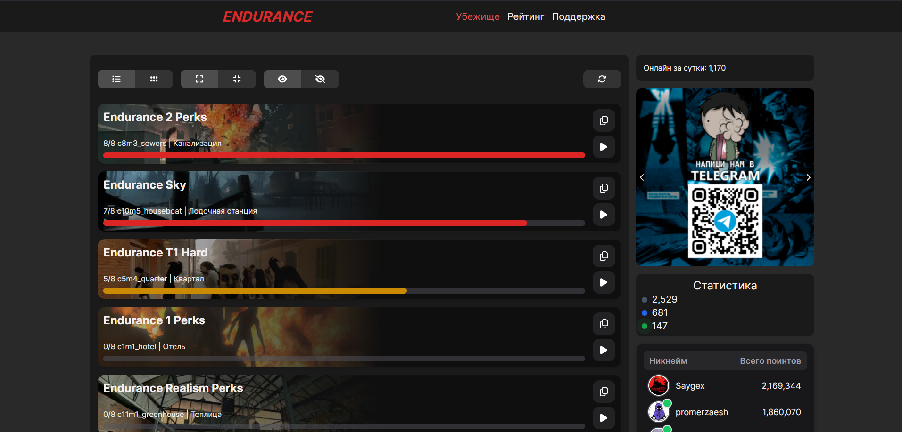
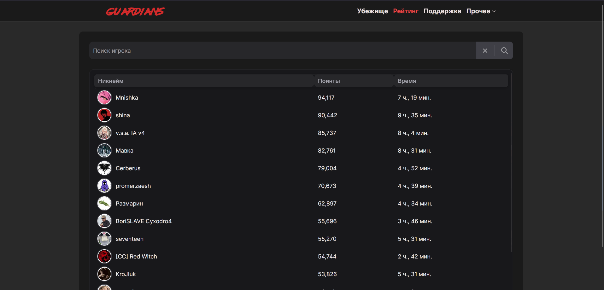
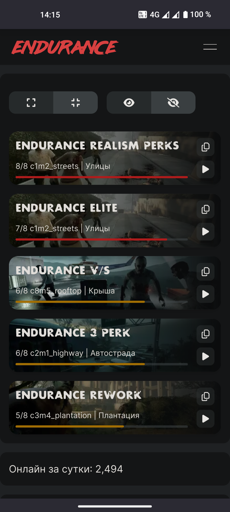
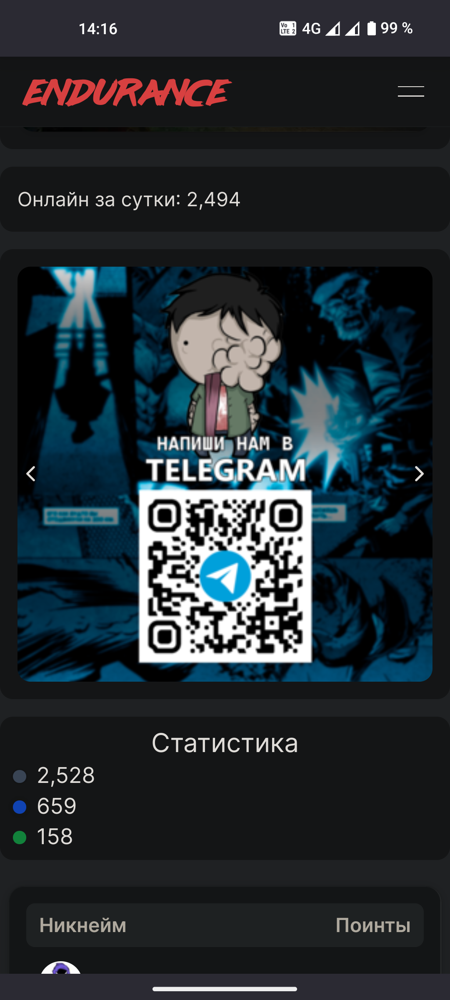
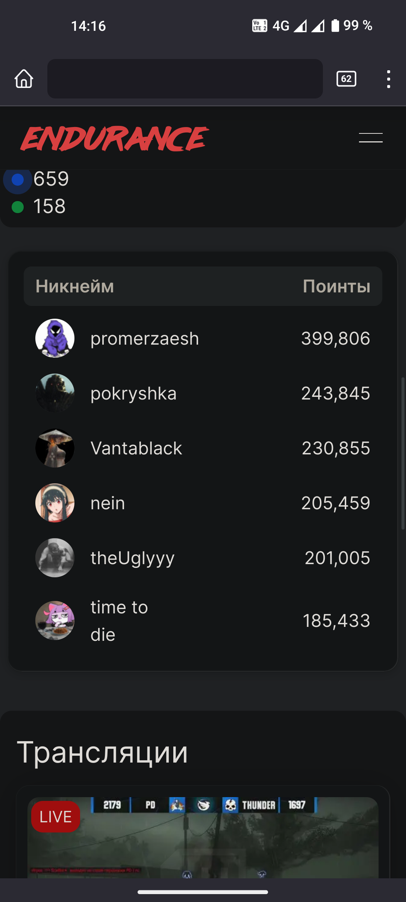
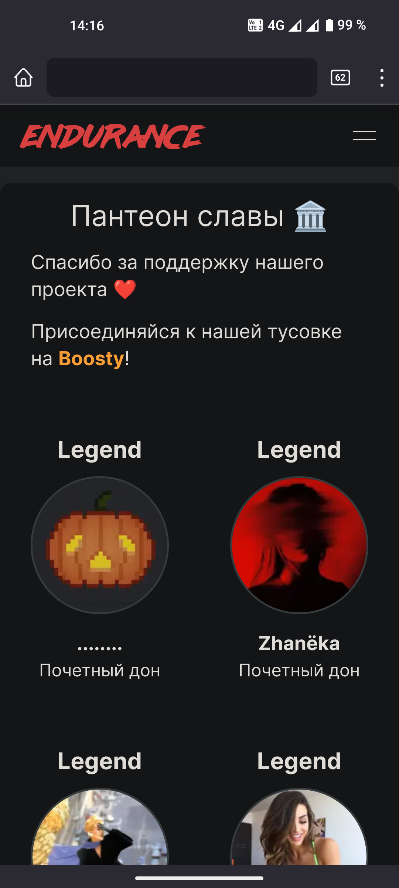
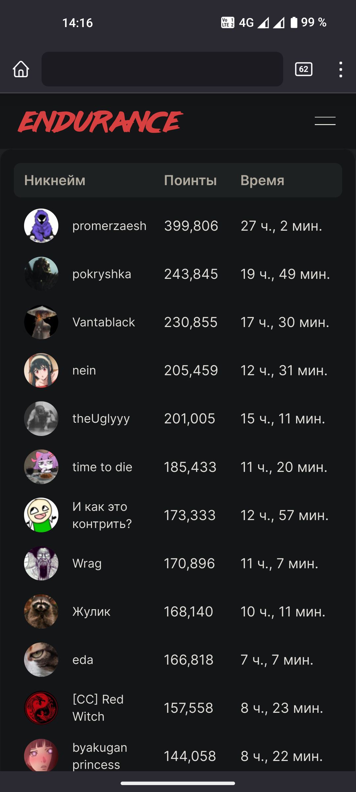

# Фронтенд для серверов Vortex

## Демонстрация
### Дескотпная версия


### Мобильная версия
<p float="left">
  
   
  
  
  
</p>

## С чего начать вносить изменения?

### Запуск

1. Очевидно, для начала надо скопировать себе этот репозиторий.
2. Для запуска используйте скрипт **dev**: ```next dev --turbo```
3. Дождитесь `✓ Ready in ... ms` и откройте [localhost:3000](http://localhost:3000). Страница сама не скомпилируется, поэтому, если вы открыли её раньше, просто обновите её.
4. Готово, вы можете вносить правки и сразу же видеть изменения. 

### Структура проекта
Исходный код находится в папке **app/**. Каждая вложенная директория с файлом **page.tsx** является отдельной страницей. Так работает роутинг в *next.js*.

В файле **app/providers.tsx** вам делать нечего, не вносите туда изменения без необходимости.

Файл **app/layout.tsx** содержит макет всех страниц, в нем можно создать хедер и футер. Также в нем находятся шрифты (сами файлы шрифтов находятся в **app/static-fonts**).

Файл **app/globals.css** содержит стили, применяемые на всех страницах здесь можно добавить новые глобальные переменные для tailwind.

Дальше структура проекта похожа на другие фреймворки и будет понятка каждому.

### components/
**api.tsx** - тут находятся все функции для работы с API.

**types.tsx** - тут находятся все типы, используемые в API.

**tools/** - тут находится статическая информация (текст, по сути), например, названия глав и список правил.

## Клиентские и серверные компоненты

Клиентские компоненты нужно использовать для интерактивных элементов, а серверные для статичных элементов и для работы с API.
#### NextUI
NextUI поддерживает оба типа компонентов. Для клиентских импортируйте из `@nextui-org/react`. Для серверных импоритруйте из `@nextui-org/<component_name>`

Пример:
```typescript
'use client'
import { Button, ButtonGroup, Avatar } from "@nextui-org/react";
```
```typescript
'use server'
import { Button, ButtonGroup } from "@nextui-org/button";
import { Avatar } from "@nextui-org/avatar";
```

## Прочее
Не забудьте посмотреть список доступных стилей в **tailwind.config.ts**.

Скрипт `next dev --turbo` не всегда работает корректно, в случае неисправности вы можете использовать `next dev`.

Клиентские компоненты не всегда обновляются, иногда вам нужно обновить страницу для того, чтобы увидеть изменения.